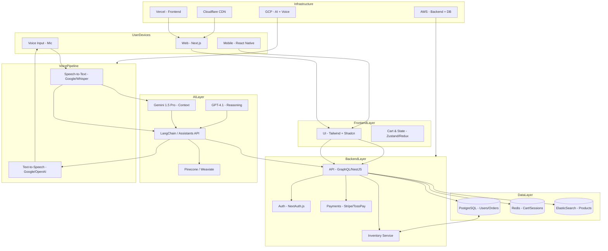

# AI E-commerce Platform 🚀

This is an ambitious and exciting project — essentially an AI-native e-commerce platform that blends conversational
commerce, natural search, personalization, and multimodal (voice/text) AI. Let me break it down into features, advanced
ideas you can add, and then recommend the most practical tech stack to achieve it.

---

## ✅ Core Features

### 1. Natural Language Product Search

- Search by description, features, or use case (e.g., "running shoes for flat feet under $150")
- LLM-powered semantic search + product embeddings

### 2. AI-Driven Recommendations

- Context-aware suggestions (brand, price, ratings, category)
- Personalized based on user behavior (clicks, purchases, wishlist)

### 3. Conversational Shopping Assistant

- Multi-turn memory (customer says "show me the red one" → AI knows which product list they mean)
- Supports tool orchestration (AI calls product API, cart API, stock API)

### 4. Persistent Cart & Real-Time Updates

- Works across sessions and devices
- Stock sync with backend inventory

### 5. Favorites, Likes, and Personalization

- Save products, sync with user profile
- Recommend based on preferences

### 6. Audio Assistant 🎙️

- English STT → query → LLM → product search → TTS response
- Like "Hey AI, show me laptops with 16GB RAM under $1000"

---

## 🔥 Advanced Features You Can Add

- **Multi-modal Input**: Upload an image → AI finds visually similar products
- **Virtual Try-On (AR)**: See how clothes, glasses, or furniture fit virtually
- **Voice Commerce**: Complete checkout with voice ("Buy the second one in my cart")
- **AI Product Descriptions**: Auto-generate engaging, SEO-optimized product texts
- **Smart Negotiation**: AI agent offers discounts or bundles based on user profile
- **Multi-Agent System**:
  - Search Agent (finds products)
  - Recommendation Agent (personalizes)
  - Negotiator Agent (handles offers)
  - Support Agent (Q&A, returns, tracking)
- **1M Token Context**: Store entire purchase history, style preferences, and conversations
- **Real-Time Translation**: Customer speaks in Korean/Spanish → system translates → responds in English or local
  language
- **Dynamic Pricing Engine**: AI suggests price adjustments based on demand and competitor prices
- **Fraud & Return Risk Detection**: AI monitors patterns and flags anomalies

---

## 🛠️ Tech Stack Recommendation

### Frontend (Web & Mobile)

- **Framework**: Next.js 15 (React-based, SSR, SEO-friendly, App Router)
- **UI**: TailwindCSS + Shadcn UI (modern, fast design system)
- **State Management**: Zustand or Redux Toolkit (persistent cart, favorites)
- **Voice Integration**: Web Speech API (browser), or Google Cloud STT SDK
- **Mobile**: React Native (reuse components) or Expo if mobile-first is important

### Backend

- **Core API Layer**:
  - Node.js (Express.js / Fastify / NestJS) → well-suited for async AI calls
  - GraphQL (Apollo) if you want flexible queries for frontend
- **Database**:
  - PostgreSQL (structured data like users, orders, inventory)
  - Redis (real-time cart, sessions, stock updates)
  - ElasticSearch / Pinecone / Weaviate (vector DB for semantic product search)
- **E-Commerce Engine**:
  - Headless Commerce (Medusa.js, Shopify Headless, or custom)
  - Integrates with LLMs for intelligent search and personalization

### AI & Orchestration

- **LLM Models**:
  - Gemini 1.5 Pro (1M token context) for deep conversations
  - GPT-4o or GPT-4.1 for reliable reasoning and tool orchestration
- **Vector Store**: Pinecone / Weaviate / Milvus → store product embeddings & user profile vectors
- **STT & TTS (Voice)**:
  - Google Cloud Speech-to-Text (fast, accurate)
  - Google Cloud / OpenAI TTS (natural responses)
  - Whisper (open-source alternative)
- **AI Orchestration Framework**:
  - LangChain or LlamaIndex for multi-agent workflows
  - OpenAI's new Assistants API (tool calling, memory, structured responses)

### Infra & DevOps

- **Hosting**: Vercel (frontend), AWS/GCP (backend, AI services)
- **Realtime**: WebSockets / Socket.io for cart & stock sync
- **Authentication**: NextAuth.js (social login, JWT, session)
- **Payments**: Stripe (global), TossPay/KakaoPay (Korea-specific)
- **CDN**: Cloudflare/Akamai for fast product delivery

---

## ⚖️ Stack Options (Closer to Reality)

### Option 1 (Fast Build, MVP)

- **Frontend**: Next.js + Tailwind
- **Backend**: Node.js + Express + PostgreSQL
- **AI**: GPT-4o (OpenAI) + Pinecone + Google STT/TTS
- **Infra**: Vercel + AWS RDS + Redis

### Option 2 (Scalable, Enterprise)

- **Frontend**: Next.js + React Native (web + mobile)
- **Backend**: NestJS + GraphQL + PostgreSQL + Redis + ElasticSearch
- **AI**: Gemini 1.5 Pro (context) + GPT-4.1 (reasoning) + Pinecone
- **Infra**: GCP (for AI + STT/TTS) + Kubernetes

---

## 💡 Recommendations

- **If you want to move fast**: Go with Option 1 (Next.js + Node.js + PostgreSQL + GPT-4o + Google STT/TTS)
- **If you're targeting long-term scalability**: Use Option 2 with multi-agent AI, GCP infra, and Gemini 1.5

---

# ai-ecommerce
